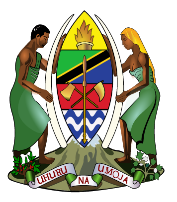

```{r setup, include=FALSE}
knitr::opts_chunk$set(echo = FALSE, eval = FALSE)
```


```{r , include=FALSE, eval=TRUE}
require(tidyverse)
library(plotly)
library(crosstalk)
library(DT)
library(leaflet)
library(forcats)
library(knitr)
require(sf)
require(magrittr)
require(tmap)


```


Overview {data-icon="fa-laptop"}
=======================================

<!-- Column {.tabset} -->
<!-- --------------------------------------- -->

Column
--------------------------------------

## Executive Summary


  
The Government of [Tanzania](https://en.wikipedia.org/wiki/Tanzania) has identified Marine Spatial Planning (MSP) as one of the priorities to address critical agendas with regards national development and resource sustainability in order to achieve national development objectives. MSP is the best tool to allow proper coordination of Marine Spatial Planning and Integrated Coastal Zone Management.

However, the critical marine ecosystems are in decline from the synergetic impacts of unsustainable use and natural disturbances, that include coastal infrastructure development, extractive industries, population growth and climate change. Inadequate collaboration among stakeholders and institutions in MSP initiatives is also a challenge for sustainable marine ecosystem management and governance. MSP is a key operational tool that connects policy dimension to the field level and secures, in an encompassing way, the aspirations and principles set out in sustainable ocean governance and sustainable blue economy strategies and policies, while taking account of the needs of different users.

In order to address these challenges, and towards establishment of MSP in Tanzania, the Vice President Office with support from WWF has organized a 3 days’ workshop with core and broader MSP stakeholder group in Morogoro, Tanzania on 14th – 16th December, 2021 to enhance the sustainability and suitability of national MSP.


The overall objective is to define methodological tool (a decision support tool) to enhance the sustainability and suitability of national MSP through the assessment of the existing spatial and temporal management tools
Specific Objectives

1. Identification of key MSP stakeholders and responsible sectors;
1. Provide key presentation and identification of existing/proposed MSP tools
1. Review of draft MSP situational Analysis Report

Expected output/outcome

1. MSP workshop report
1. Methodological tools to enhance the sustainability and suitability of MSP in Tanzania
1. Identified key stakeholders for engagement in MSP agenda


Column
--------------------------------------
```{r, out.width = "30%", eval=TRUE}


```


<!-- #### Abstract -->

<!-- Scientists across many fields are faced with the challenge of synthesizing and communicating information from large and complex data sets. This growth in data, alongside the computational methods used to integrate it, can make the process of communicating the results to stakeholders and managers in a meaningful way more daunting. The traditional approach of presenting information across a series of static slides and plots often fails to convey the richness of information available and, as such, important patterns and details are easily overlooked.  -->

<!-- Dr. Paul Regular and his co-workers in Newfoundland and Labrador region contend that this problem can be mediated through the effective use of new open source tools for building interactive visualizations (e.g. R packages such as `flexdashboard`, `shiny` and `plotly`). These tools allow a broader audience to conduct detailed explorations of the results, leading to a deeper and collective understanding of both the data and models used to inform Science advice. As a consequence, the peer review process is more open and accessible and the resulting science advice is improved and widely supported. -->


<!-- #### Outcomes of the workshop -->

<!-- This workshop was developed and proposed to promote learning and development relevant for staff in OESD, CESD, SPAD and PED at BIO. Full proposal was submitted in July 2019 and is accesible here: -->
<!-- https://docs.google.com/document/d/1uMrd_UhAEI9R4wZ0bFQeYr6ZVFqTe4MA/edit -->

<!-- This workshop enabled us to learn about the use of interactive tools, its role in supporting Science advice, and a discussion of a path-forward to extend this to other approaches in DFO.  -->

<!-- This dashboard was created by Paul Regular and Catalina Gomez following the workshop to share resources and tools available at our fingertips. Freya Keyser and Jessica Sameoto contributed with content, and code for the participant evaluation section. -->


<!-- ### Getting Started  -->


<!-- **Dashboards in R**   -->

<!-- Step 1:  -->
<!-- Watch Paul's BIO seminar & get inspired: https://drive.google.com/file/d/1XHLmOl6gV4kY5_0STdk42vTarkFI0VzR/view?usp=sharing -->

<!-- Step 2:  -->
<!-- Watch the TESA webinar: https://www.gcpedia.gc.ca/wiki/DFO_Science_TESA_ETES -->

<!-- Step 3: -->
<!-- Download the *getting started dashboard* to your machine (and use google chrome to visualize this html): https://drive.google.com/file/d/1Nttg8aYjVJLtg_9ndDYnS131pycNbfsh/view?usp=sharing -->

<!-- Step 4:  -->
<!-- Clone and explore this dashboard to learn about the workshop.  -->

<!-- - Open Rstudio -->
<!-- - File > New Project > Version Control -->
<!-- - Git -->
<!-- - Clone Git Repository -->
<!-- - Repository URL: https://github.com/AtlanticR/bioRworkshops.git -->
<!-- - Project directory name: bioRworkshops -->

<!-- The full repository to create this flashboard is in the Atlantic R GitHub site: -->
<!-- https://github.com/AtlanticR/bioRworkshops/tree/master/16_ToolsScienceAdvice -->

<!-- Step 5: -->
<!-- Create your own dashboard and share (!)  -->

<!-- - Inventory of shiny apps and dashboards: https://docs.google.com/spreadsheets/d/1teh5CWZHJaJamUPVLxgDMtiFh3PlOSOT/edit#gid=769397193 -->


<!-- ### Agenda -->


<!-- Agenda for workshop on November 5th 2019 distributed to workshop participants:   -->

<!-- https://docs.google.com/spreadsheets/d/1rWqus06dRR5TQfTOwpfq9Ul862BvzZ7rG5qXJOSuC-s/edit#gid=0 -->

<!-- ### Pre-workshop material: Shiny! -->


<!-- **Intro to Shiny Apps**   -->

<!-- Chantelle Layton & Clark Richards led a workshop at BIO to learn about Shiny apps in R. Shiny takes a fresh, interactive approach to telling your data story.  -->

<!-- - The code used in this workshop is in the Atlantic R GitHub site: -->
<!-- https://github.com/AtlanticR/bioRworkshops/tree/master/14_Shiny_intro -->

<!-- - To watch the recording of this workshop, use Internet explorer and this link below: https://drive.google.com/file/d/1lk-gNbqdhpXEJKNaljfqI1oZFVev2i-L/view   -->

<!-- - Code repo for this workshop is here: https://github.com/AtlanticR/bioRworkshops/tree/master/14_Shiny_intro -->

<!-- - Explore the onventory of shiny apps and dashboards under-development with contirbutions from DFO colleagues:  -->
<!-- https://docs.google.com/spreadsheets/d/1teh5CWZHJaJamUPVLxgDMtiFh3PlOSOT/edit#gid=769397193 -->


Map {data-icon="fa-map"}
=======================================


```{r, eval=TRUE}
## data
landing.sites = st_read("d:/semba/Projects/MASTER/tansea/tza_zan_fish_landing_sites_10k.shp", quiet = TRUE)

iba = st_read("d:/semba/Projects/MASTER/tansea/tza_important_bird_areas_.shp", quiet = TRUE)

coelacanth = st_read("d:/semba/Projects/MASTER/tansea/tza_coelacanth_200k.shp", quiet = TRUE)

dolphin = st_read("d:/semba/Projects/MASTER/tansea/tza_dolphin_sites_200k.shp", quiet = TRUE)

dugong = st_read("d:/semba/Projects/MASTER/tansea/tza_dugong_sightings_200k.shp", quiet = TRUE)

prawn.culture = st_read("d:/semba/Projects/MASTER/tansea/tza_fish_prawn_culture_10k.shp", quiet = TRUE)

ports = st_read("d:/semba/Projects/MASTER/tansea/tza_harbours_and_ports.shp", quiet = TRUE)

mpa = st_read("d:/semba/Projects/MASTER/tansea/tza_marine_protected_areas_xx.shp", quiet = TRUE)


coastal_features = st_read("d:/semba/vpo/data/shp/coastal_land_cover.shp", quiet = TRUE) %>% 
  janitor::clean_names() 

coastal.only = coastal_features %>% 
  filter(class %in% c("Mangrove", "Salt marsh", "Tidal reef", "Salt pan", "Saline bare area", "Sand", "Seagrass", "Swamp") )

tmap_options(check.and.fix = TRUE)


```


Column {.sidebar}
-------------------------------------

### Inputs

```{r}

filter_select("MISSION", "Mission", shared_rv, ~MISSION)
filter_select("COMM", "Species", shared_rv, ~COMM)

```


Column {.tabset}
-------------------------------------

### Map connected to filters

```{r}

p <- plot_geo(data = shared_rv, x = ~LONGITUDE, y = ~LATITUDE, color = ~COMM,
              size = ~TOTWGT, sizes = c(10, 500),
              colors = viridis::viridis(3)) %>%
  add_markers() %>%
  layout(geo = list(resolution = 50,
                    showland = TRUE,
                    landcolor = toRGB("grey90"),
                    coastlinecolor = toRGB("grey80"),
                    projection = list(type = "mercator"),
                    lonaxis = list(range = c(-75, -45)),
                    lataxis = list(range = c(40, 50))))
p
```


```{r, eval=TRUE}

tmap_mode(mode = "view")

tm_shape(shp = iba, name = "Important Bird Areas")+
  tm_fill(col = "red", alpha = .1)+
tm_shape(shp = mpa, name = "Marine Protected Areas")+
  tm_fill(col = "green", alpha = .1)+
tm_shape(shp = coastal.only %>% dplyr::select(class), name = "Coastal Habitat") +
  tm_fill(col = "class", title = "Habitat Type") +
tm_shape(shp = coelacanth %>% dplyr::select(NAME), name = "Coelacanth Sites") +
  tm_symbols(col = "blue", border.col = "darkblue", size = .02, alpha = .1)+
tm_shape(shp = dolphin %>% dplyr::select(NAME), name = "Dolphin Sites")+
  tm_symbols(size = 0.02, col = "green", border.col = "green", alpha = .2)+
tm_shape(shp = dugong %>% dplyr::select(Name), name = "Dugong Sites")+
  tm_symbols(size = 0.02, col = "maroon", border.col = "maroon", alpha = .2)+
tm_shape(shp = ports %>% dplyr::select(Name), name = "Harbours and Ports")+
  tm_symbols(size = 0.02, col = "darkgreen", border.col = "darkgreen", alpha = .2)+
tm_shape(shp = landing.sites %>% dplyr::select(Name), name = "Landing Sites") +
  tm_markers(clustering = TRUE, text ="Name" ,  text.just = "top",  markers.on.top.of.text = FALSE,  group = NA)+
tm_shape(shp = prawn.culture, name = "Prawn Culture") +
  tm_markers(clustering = TRUE, text ="Name" ,  text.just = "top",  markers.on.top.of.text = FALSE,  group = NA)

```

### Deep Sea Tunas


```{r, eval=TRUE}

tunas = read_csv("d:/semba/tuna_project/data_dpsa/processed/tuna_clean_teez_sst_chl_pp_u_v_xwind_ywind_sla.csv") %>% 
  mutate(category_name = str_remove_all(string = category_name, pattern = "Tuna"))

```

```{r, eval=TRUE}
require(mgcv)

tuna.group = tunas %>% 
  distinct(category_name) %>% 
  pull()

tuna.gam.tb = list()

for (i in 1:length(tuna.group)){

tuna.gam = tunas %>% 
  filter(category_name == tuna.group[i])%$%
  gam(weight ~ s(lon,lat))

tuna.gam.tb[[i]] = tuna.gam %>% 
  tidymv::predict_gam() %>% 
  select(lon, lat, weight = fit) %>% 
  mutate(species = tuna.group[i])


}
```


```{r, eval=TRUE}

tuna.gam.sf = tuna.gam.tb %>% 
  bind_rows() %>% 
  st_as_sf(coords = c("lon", "lat"), crs = 4326)


```


```{r, eval=TRUE}
## convert table into raster for each species
## skipjack

skipjack <- raster::raster(nrow=50, ncol=50, 
            ext=raster::extent(40.11, 44.416, -10.05, -4.5), 
            crs=4326)


raster::values(skipjack) <-  tuna.gam.tb %>% 
  bind_rows()%>% 
  filter(species == "Skip Jack ") %>% 
  pull(weight)

skipjack[skipjack <= 0] = NA

## bigeye

bigeye <- raster::raster(nrow=50, ncol=50, 
            ext=raster::extent(40.11, 44.416, -10.05, -4.5), 
            crs=4326)


raster::values(bigeye) <-  tuna.gam.tb %>% 
  bind_rows()%>% 
  filter(species == "Big Eye ") %>% 
  pull(weight)

bigeye[bigeye <= 0] = NA


## yellowfin

yellowfin <- raster::raster(nrow=50, ncol=50, 
            ext=raster::extent(40.11, 44.416, -10.05, -4.5), 
            crs=4326)


raster::values(yellowfin) <-  tuna.gam.tb %>% 
  bind_rows()%>% 
  filter(species == "Yellow Fin ") %>% 
  pull(weight)

yellowfin[yellowfin <= 0] = NA

## swordfish

swordfish <- raster::raster(nrow=50, ncol=50, 
            ext=raster::extent(40.11, 44.416, -10.05, -4.5), 
            crs=4326)


raster::values(swordfish) <-  tuna.gam.tb %>% 
  bind_rows()%>% 
  filter(species == "Swordfish") %>% 
  pull(weight)

swordfish[swordfish <= 0] = NA


```


```{r, eval=TRUE}
tmap_mode(mode = "view")

tm_shape(shp = skipjack)+
  tm_raster(col = "layer", title = "Skipjack (MT)", 
            n = 8, style = "pretty", as.count = TRUE,palette = "viridis",
            interpolate = TRUE) +
tm_shape(shp = bigeye)+
  tm_raster(col = "layer", title = "Big eye (MT)", 
            n = 8, style = "pretty", as.count = TRUE,palette = "viridis",
            interpolate = TRUE) +
tm_shape(shp = yellowfin)+
  tm_raster(col = "layer", title = "Yellowfin (MT)", 
            n = 8, style = "pretty", as.count = TRUE, palette = "viridis",
            interpolate = TRUE) +
tm_shape(shp = swordfish)+
  tm_raster(col = "layer", title = "Swordfish (MT)", 
            n = 8, style = "pretty", as.count = TRUE, palette = "viridis",
            interpolate = TRUE) 
  
```


```{r}

leaflet(shared_rv) %>%
  addTiles() %>%
  addCircleMarkers(stroke = FALSE,
                   fillOpacity = 0.5, radius = 3,
                   color = ~viridis::viridis(3)[factor(COMM)])

```


### Animated map using the plotly frame argument

```{r}

p <- plot_geo(data = rv, x = ~LONGITUDE, y = ~LATITUDE, color = ~COMM,
              frame = ~YEAR, size = ~TOTWGT, sizes = c(10, 500),
              colors = viridis::viridis(3)) %>%
  add_markers() %>%
  layout(geo = list(resolution = 50,
                    showland = TRUE,
                    landcolor = toRGB("grey90"),
                    coastlinecolor = toRGB("grey80"),
                    projection = list(type = "mercator"),
                    lonaxis = list(range = c(-75, -45)),
                    lataxis = list(range = c(40, 50)))) %>%
  highlight(persisten = TRUE, off = "plotly_relayout")
p
```


<!-- Plots {data-icon="fa-signal"} -->
<!-- ======================================= -->

<!-- Column -->
<!-- ------------------------------------- -->

<!-- ### Temperature -->

<!-- ```{r} -->
<!-- plot_ly(data = shared_rv) %>% -->
<!--   add_markers(x = ~BOTTOM_TEMPERATURE, y = ~SURFACE_TEMPERATURE, -->
<!--               color = ~COMM, colors = viridis::viridis(3), -->
<!--               size = ~TOTWGT, sizes = c(10, 500)) %>% -->
<!--   highlight(persisten = TRUE, off = "plotly_relayout") -->

<!-- ``` -->

<!-- > Markers sized based on total weight captured -->


Data {data-icon="fa-database"}
=======================================

Column
-------------------------------------

<!-- ### Results -->

```{r}
DT::datatable(shared_rv, extensions = 'Buttons',
              options = list(dom = 'Bfrtip',
                             buttons = c('csv', 'excel')))
```


```{r, eval=TRUE}

mimp = readxl::read_excel("d:/semba/wwf_report/mimp/MIMP _ Longterm Fish catch data.xlsx") %>% 
  janitor::clean_names() %>% 
  mutate(landing = str_to_title(landing),
         month = lubridate::month(date), 
         year = lubridate::year(date)) %>% 
  dplyr::select(-c(kas_id, district, village, month_year, no_of_gears:return_time, jina, fishing_time, date)) %>% 
  separate(col = aina, into = c("swahili_name", "family")) %>% 
  relocate(c(fish_number), .before = weight) %>% 
  relocate(c(month, year), .before = landing)


mimp %>% 
  sample_n(size = 300) %>% 
  mutate(gear_type = str_to_title(gear_type), 
         swahili_name = str_to_title(swahili_name), 
         family = str_to_title(family)) %>% 
  DT::datatable(
           extensions = c("Buttons" , "FixedColumns"),
           # filter = 'top',
           options = list( autoWidth = TRUE , 
                           dom = 'Blftip',
                           pageLength = 20,
                           searchHighlight = FALSE,
                           buttons = c('copy', 'csv', 'print'),
                           scrollX = TRUE,
                           scrollY = "565px",
                           fixedColumns = list(leftColumns = 2)),
           class = c('compact cell-border stripe hover') ,
           rownames = FALSE) 
  
  
  
  
  # DT::datatable(extensions = 'Buttons',
  #             options = list(dom = 'Bfrtip',
  #                            buttons = c('csv', 'excel')))
```


Summary {data-icon="fa-signal"}
=======================================


Column
--------------------------------------

**Summary of post-workshop evaluation results**

Workshop participants were asked to complete an evaluation survey at the end of the workshop. Of the 29 attendees, 19 responses were received (65% response rate). Responses were received from participants in the four Science divisions (Figure 1).

Participants were asked to rate the workshop on various factors on a scale of 0-5 (low to high). The minimum rating for any question was 3, and average ratings were all above 4 (Figure 2). 

All survey respondents answered that they would recommend this workshop to others. 12 respondents provided comments. They highlighted:

   * the content was interesting and was highly applicable to their work activities
   * they enjoyed engaging with others outside their normal workgroup
   * they felt they learned a lot
   
 
All survey respondents answered that they would try the techniques used in the course. 10 respondents provided comments. They highlighted:

   * the communication value of using dashboards with stakeholders or in CSAS processes to improve comprehension and transparency
   * the efficiency of using dashboards to explore and quality control data


There were 8 responses to the question "What were you hoping to learn in this workshop that you did not?" Responses included:

   * mapping
   * presentation methods
   * integrating Shiny into a dashboard format
   * more examples and more time to practice
 

Participants were asked for suggestions of topics for future workshops. The 8 responses highlighted:

   * cloud computing with RStudio
   * Shiny
   * spatial modelling/analysis
   * Github
   * R package development
   * integrating work between units/divisions

Survey respondents reported that they would be most available for future workshops between November and March (Figure 3).

Column
--------------------------------------


```{r, eval=TRUE}
# mimp %>% 
#   group_by(swahili_name) %>% 
#   summarise(count = n(), .groups = "drop")  %>% 
#   arrange(desc(count)) %>% 
#   mutate(swahili_name = str_to_title(swahili_name)) %>% 
#   filter(count >= 1000) %>% 
#   plot_ly() %>% 
#   add_pie(labels = ~swahili_name, values = ~count)%>%
#   layout(title = "Species Composition in Mafia Island")


mimp %>% 
  group_by(swahili_name) %>% 
  summarise(count = n(), .groups = "drop")  %>% 
  arrange(desc(count)) %>% 
  mutate(swahili_name = str_to_title(swahili_name)) %>% 
  filter(count >= 1000) %>%
  plot_ly(type='pie', labels = ~swahili_name, values = ~count, 
          hole = 0.6,
          textinfo='label+percent',
          insidetextorientation='radial') %>% 
  layout(title = "Species Composition at Mafia Island",  
         showlegend = F,
         xaxis = list(showgrid = FALSE, zeroline = FALSE, 
                      showticklabels = FALSE),
         yaxis = list(showgrid = FALSE, 
                      zeroline = FALSE, showticklabels = FALSE))
```


<!-- ```{r} -->
<!-- mimp %>%  -->
<!--   mutate(season = if_else(month %in% c(5:9), "SE", "NE")) %>%  -->
<!--   group_by(swahili_name, season) %>%  -->
<!--   summarise(price = median(fish_price, na.rm = TRUE) , .groups = "drop")  %>%  -->
<!--   datawizard::reshape_wider(values_from = "price", colnames_from = "season", names_from = "season") %>%  -->
<!--   rename(NE = 2, SE = 3) %>%  -->
<!--   mutate(swahili_name = str_to_title(swahili_name), gap = (NE-SE)/500) %>% -->
<!--   drop_na() %>%  -->
<!--   wior::outlier_remove(x = SE) %>%  -->
<!--   wior::outlier_remove(NE) %>%  -->
<!--   # filter(price < 100000) %>%  -->
<!--   plot_ly(x = ~NE, y = ~SE, text = ~swahili_name, type = 'scatter', mode = 'markers', color = ~swahili_name, -->
<!--         marker = list(size = ~gap, opacity = 0.5))%>%  -->
<!--   layout(title = 'Gender Gap in Earnings per University', showlegend = FALSE, -->
<!--          xaxis = list(showgrid = FALSE), -->
<!--          yaxis = list(showgrid = FALSE)) -->

<!-- ``` -->


<!-- ```{r, echo=F, fig.align='center'}   -->
<!-- eval <- read.csv("workshop_evaluation.csv") -->

<!-- q1 <- data.frame(table(eval[, 2])) -->
<!-- levels(q1$Var1) <- c("CESD", "OESD", "ODIS", "PED") -->

<!-- p <- ggplot() + geom_bar(data=q1, aes(Var1, Freq), stat="identity") + theme_classic() + -->
<!--   xlab("What Science Division are you in?") + -->
<!--   ylab("Number of respondents") -->
<!-- ggplotly(p) -->
<!-- ```   -->


<!-- ### Figure 2. Monthly average of Temperature -->


<!-- ```{r} -->
<!-- dar = wior::get_meteo(coastal_codes = 3, begin_year = 2019, end_year = 2021) -->


<!-- dar.temp = dar %>%  -->
<!--   mutate(month = lubridate::month(date, label = FALSE)) %>%  -->
<!--   distinct(date, .keep_all = TRUE) %>%  -->
<!--   group_by(month) %>%  -->
<!--   summarise(temp_ave = median(air_temp, na.rm = TRUE),  -->
<!--             temp_min = min(air_temp, na.rm = TRUE), temp_max = max(air_temp, na.rm = TRUE)) -->


<!-- dar.temp %>%  -->
<!--   write_csv("dar_temperature.csv") -->
<!-- ``` -->


<!-- ```{r, eval=TRUE} -->

<!-- dar.temp = read_csv("dar_temperature.csv") -->

<!-- dar.temp = dar.temp %>% mutate(month = lubridate::make_date(year = 2020, month = month, day = 15)) -->


<!-- fig <- plot_ly(dar.temp, x = ~month, y = ~temp_max, type = 'scatter', mode = 'lines', -->
<!--         line = list(color = 'transparent'), -->
<!--         showlegend = FALSE, name = 'High')  -->
<!-- fig <- fig %>% add_trace(y = ~temp_min, type = 'scatter', mode = 'lines', -->
<!--             fill = 'tonexty', fillcolor='rgba(0,100,80,0.2)', line = list(color = 'transparent'), -->
<!--             showlegend = FALSE, name = 'Low')  -->
<!-- fig <- fig %>% add_trace(x = ~month, y = ~temp_ave, type = 'scatter', mode = 'lines', -->
<!--             line = list(color='rgb(0,100,80)'), -->
<!--             name = 'Average')  -->
<!-- fig <- fig %>% layout(title = "Average, High and Low Temperatures in New York", -->
<!--          paper_bgcolor='rgb(255,255,255)', plot_bgcolor='rgb(229,229,229)', -->
<!--          xaxis = list(title = "Months", -->
<!--                       gridcolor = 'rgb(255,255,255)', -->
<!--                       showgrid = TRUE, -->
<!--                       showline = FALSE, -->
<!--                       showticklabels = TRUE, -->
<!--                       tickcolor = 'rgb(127,127,127)', -->
<!--                       ticks = 'outside', -->
<!--                       zeroline = FALSE), -->
<!--          yaxis = list(title = "Temperature (degrees C)", -->
<!--                       gridcolor = 'rgb(255,255,255)', -->
<!--                       showgrid = TRUE, -->
<!--                       showline = FALSE, -->
<!--                       showticklabels = TRUE, -->
<!--                       tickcolor = 'rgb(127,127,127)', -->
<!--                       ticks = 'outside', -->
<!--                       zeroline = FALSE)) -->

<!-- fig -->
<!-- ``` -->


<!-- ```{r, echo=F, fig.align='center'} -->
<!-- ratings <- eval[, c(1,3:10)] -->
<!-- ratings <- melt(ratings, id.vars = "Timestamp") -->
<!-- ratings$variable <- as.factor(gsub(ratings$variable, pattern=".", replacement =" ", fixed=T)) -->
<!-- ratings$variable <- as.factor(gsub(ratings$variable, pattern="  ", replacement =" ", fixed=T)) -->
<!-- ratings$value <- as.numeric(ratings$value) -->

<!-- numbering <- c("4. ", "6. ", "2. ", "7. ", "8. ", "1. ", "3. ", "5. ") -->
<!-- levels(ratings$variable) <- paste0(numbering, levels(ratings$variable)) -->
<!-- ratings$variable <- as.factor(as.character(ratings$variable)) -->

<!-- ratings_avg <- ddply(.data=ratings, .(variable), -->
<!--                      summarize, -->
<!--                      mean_rating = mean(value)) -->

<!-- ratings$variable <- fct_rev(ratings$variable) -->

<!-- ggplotly(ggplot() + geom_boxplot(data=ratings, aes(variable, value)) +  -->
<!--         geom_point(data=ratings_avg, aes(variable, mean_rating))+ -->
<!--         theme_classic() + -->
<!--   xlab(NULL) + ylab("Rating from low to high") +  -->
<!--   ylim(0,5) + -->
<!--   coord_flip()) -->

<!-- ```   -->


