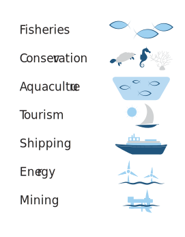
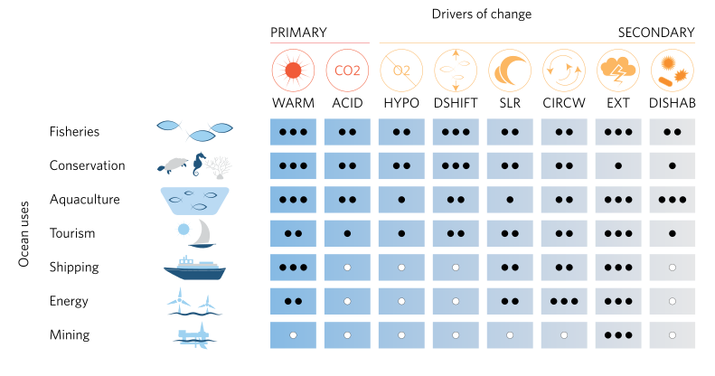

```{r setup, include=FALSE}
knitr::opts_chunk$set(echo = FALSE, warning = FALSE, message = FALSE, comment = "")


conflicted::conflict_prefer(name = "select", winner = "dplyr")
conflicted::conflict_prefer(name = "filter", winner = "dplyr")

require(tidyverse)
require(sf)
require(plotly)
require(sf)
require(magrittr)
require(tmap)
# require(raster)
```

# Marine Planning
<!-- ## What I will cover!! -->

<!-- + Introduction of MSP -->
<!-- + Present application -->
<!-- + Gap -->
<!-- + Opportunity -->
<!-- + Outlook -->


## Background---Ocean Uses

```{r}

# knitr::include_graphics("graphics/ocan uses.pdf")
```


## Background---Ocean Uses

+ Carefully planning is required to minimize conflicts and foster compatibilities among uses
+ This planning process is termed *marine spatial  planning (MSP)*, 
+ MSP foster sustainable ocean management and governance.  

## Marine Spatial Planning

+ MSP is a public process of `analyzing` and `allocating` the `spatial` and `temporal` distribution of *human activities* in **marine areas** 
+ The prime aspect of MSP are 
   i. to achieve ecological, economic and social.
   i. to create and establish a more rational use of marine space and the interactions among its uses, 
   i. to balance demands for development with the need to protect the environment, and 
   i. to deliver social and economic outcomes in an open and planned way.

## Ocean Challenges

<!-- + This include Population growth, Ocean warming, Ocean Acidification -->
<!-- + As a consequence, marine ecosystem services will be redistributed, and  -->
<!-- + Ocean uses that rely on those services will undergo spatial and temporal change through local decrease or increase, or relocation.  -->
<!-- + They requires flexible and adaptive ocean planning -->

```{r}



```


# Current Situation
## Current Situation

+ Marine scientists  face a challenge of synthesizing and communicating information from large and complex data sets. 
+ Growth in data and advance in computational, can make the process of communicating the results to decision makers in a meaningful way. 
+ The traditional approach of presenting information across a series of static slides and plots often fails to convey the richness of information available.


## Tanzania Sensitivity Atlas

+ The institute of Marine Sciences developed the [Tanzania Sensitivity Atlas](https://ims.udsm.ac.tz/tansea/)
+ IMS also involved in developing the [African Marine Atlas](http://www.africanmarineatlas.org/)

# GAP
## Existing

+ Static
+ Difficult to update
+ 

# Opportunity

## Tools for interactive visualization

+ Interactive maps
+ Interactive plots
+ engage users and stakeholders
+ easy to update the information
+ backend serve as database


# Tools for Effective MSP

## Tools for MSP

+ ocean management requires the integration and analysis of large and diverse data sets
+ reproducible, and collaborative tools are needed to analyze, visualize, and update data in an efficient and cost-effective manner.
+ Overcome the inherited challenge of traditional static outputs (e.g., tables, figures, reports, maps)+

## Interactive tools

+ Interactive plots combined with spatial tools are effective way to communicate information used to inform decision-making processes such as 

   + stock assessment, 
   + ecosystem approaches to fisheries management, 
   + conservation planning, and 
   + marine spatial planning.


## Interactive Tools

+ Interactive tools allows
   + The audience to interact with data and data products,
   + users to control over type of information 
   + Users to download, filter, and re-plot the data to their desired test
   + Provide room to work in a more open and transparent manner.


## R languages for MSP

+ R programming language has grown into a software that offers tools to build interactive tools for effective communication
+ These web apps web applications are increasingly being used to explore research interactively.

# Packages
## Interactive tools building dashboard

+ **Flexdashboard**---R package provides structure and containers where information will be placed
<!-- + It uses R Markdown to render related images, figures, and texts into a dashboard-based interface. The dynamism of this dashboard is automatically transferred into display functionalities to zoom in and out, and to transfer to mobile-mode if the dashboard is visualized on mobile devices.  -->

<!-- The dashboard supports a wide range of components, including R base graphics, ggplot2 (Wickham 2016), gauges, tables, and html widgets such as plotly (Sievert 2018) and leaflet (Cheng et al. 2018). It can also use shiny (Chang et al. 2018) or crosstalk (Cheng et al. 2016) to bolster interactivity. -->

+ **Plotly**--- This package supports the creation of interactive graphics
<!-- . The package allows the user to create interactive web graphics from ggplot2 (Wickham 2016) graphs. It also provides a more ‘direct’ link to the core plotly.js JavaScript library using syntax inspired by the grammar of graphics. -->

+ **Shiny** ---


+ **Crosstalk**---the package enables cross-widget interactions by linking, brushing, and/or filtering across multiple views. 

<!-- This means that interactions with one plot can affect changes in another plot within the flexdashboard interface. In this way, filters can be applied to two linked plots, tables or a combination of plots and tables that may be in the same or in different pages. This allows users to, for example, select/highlight one point in one plot and then be able to visualize the same point in a different plot. Crosstalk supports a wide range of htmlwidgets, such as plotly and leaflet. -->

# illutrative

```{r}

data(land, World)
```


## Static Terrain

```{r}
tmap_mode(mode = "plot")

tm_shape(land) +
	tm_raster("elevation", breaks=c(-Inf, 250, 500, 1000, 1500, 2000, 2500, 3000, 4000, Inf),  
		palette = terrain.colors(9), title="Elevation", midpoint = NA) +
tm_shape(World, is.master=TRUE, projection = "+proj=eck4") +
	tm_borders("grey20") +
	tm_graticules(labels.size = .5) +
	tm_text("name", size="AREA") +
tm_compass(position = c(.65, .15), color.light = "grey90") +
tm_credits("Eckert IV projection", position = c("right", "BOTTOM")) +
tm_style("classic") +
tm_layout(bg.color="lightblue",
	inner.margins=c(.04,.03, .02, .01), 
	earth.boundary = TRUE, 
	space.color="grey90") +
tm_legend(position = c("left", "bottom"), 
	frame = TRUE,
	bg.color="lightblue")
```

## Interactive Terrain

```{r}
tmap_mode(mode = "view")

tm_shape(land) +
	tm_raster("elevation", breaks=c(-Inf, 250, 500, 1000, 1500, 2000, 2500, 3000, 4000, Inf),  
		palette = terrain.colors(9), title="Elevation", midpoint = NA) +
tm_shape(World, is.master=TRUE, projection = "+proj=eck4") +
	tm_borders("grey20") +
	tm_graticules(labels.size = .5) +
	tm_text("name", size="AREA") +
tm_credits("Eckert IV projection", position = c("right", "BOTTOM")) +
tm_style("classic") +
tm_layout(bg.color="lightblue",
	inner.margins=c(.04,.03, .02, .01), 
	earth.boundary = TRUE, 
	space.color="grey90") 
```


## static pop
```{r}
tmap_mode("plot")

tm_shape(World) +
    tm_polygons(c("HPI", "economy")) +
    tm_facets(sync = TRUE, ncol = 1)+
  tm_compass(position = c(0.08, 0.45), color.light = "grey90", size = 3) +
  tm_credits("The Institute of Marine Sciences", position = c("RIGHT", "BOTTOM")) +
  # tm_style("classic",
  #        bg.color = "lightblue",
  #        space.color = "grey90",
  #        inner.margins = c(0.04, 0.04, 0.03, 0.02), 
  #        earth.boundary = TRUE)+
  tm_legend(position = c("left", "bottom"), 
            frame = TRUE,
            bg.color = "lightblue")
```


## Interactive pop

```{r}
tmap_mode("view")

tm_shape(World) +
    tm_polygons(c("HPI", "economy")) +
    tm_facets(sync = TRUE, ncol = 2, drop.NA.facets = TRUE)
```

## interactive continues

```{r}
coastal_features = st_read("d:/semba/vpo/data/shp/coastal_land_cover.shp", quiet = TRUE) %>% 
  janitor::clean_names() 

coastal.only = coastal_features %>% 
  filter(class %in% c("Mangrove", "Salt marsh", "Tidal reef", "Salt pan", "Saline bare area", "Sand", "Seagrass", "Swamp") )

tmap_options(check.and.fix = TRUE)
```


```{r}
tm_shape(shp = coastal.only) +
  tm_fill(col = "class", title = "Habitat Type")
```

## Tunas

```{r}
eez = st_read("d:/semba/vpo/data/shp/eez.shp", quiet = TRUE)

sheets = readxl::excel_sheets(path = "d:/semba/dsfa_fumba/purse_seine_EEZ _CATCH_DATA_2014.xls")
```


```{r}
purse = list()

for (i in 1:length(sheets)){
  purse[[i]] = readxl::read_excel("d:/semba/dsfa_fumba/purse_seine_EEZ _CATCH_DATA_2014.xls", 
                           sheet = sheets[i], 
                           col_types = c("text", "text", "date", "numeric",
                                         "numeric", "numeric", "numeric")) %>% 
  janitor::clean_names()
  
}


purse.all = purse %>% 
  bind_rows() %>% 
  mutate(catch_rate = (wt_mt*1000)/fishing_effort , 
         category_name = str_to_title(category_name), 
         species = str_remove_all(string = category_name, pattern = "Tuna"), 
         latitude = if_else(latitude == -605, -6.05, latitude)) %>% 
  mutate(latitude = if_else(latitude == -7650, -7.65, latitude)) %>% 
  relocate(species, .after = category_name) %>% 
  select(-c(gears, category_name))

# purse.all %>% 
#   skimr::skim(latitude)
```


```{r}
purse.sf = purse.all %>% 
  drop_na() %>% 
  st_as_sf(coords = c("longitude", "latitude"), crs = 4326)
```

```{r, eval=FALSE}

tm_shape(shp = purse.sf)+
  tm_symbols(col = "catch_rate", size = "catch_rate")

```

```{r}

tunas = read_csv("d:/semba/tuna_project/data_dpsa/processed/tuna_clean_teez_sst_chl_pp_u_v_xwind_ywind_sla.csv") %>% 
  mutate(category_name = str_remove_all(string = category_name, pattern = "Tuna"))

```

```{r}
require(mgcv)

tuna.group = tunas %>% 
  distinct(category_name) %>% 
  pull()

tuna.gam.tb = list()

for (i in 1:length(tuna.group)){

tuna.gam = tunas %>% 
  filter(category_name == tuna.group[i])%$%
  gam(weight ~ s(lon,lat))

tuna.gam.tb[[i]] = tuna.gam %>% 
  tidymv::predict_gam() %>% 
  select(lon, lat, weight = fit) %>% 
  mutate(species = tuna.group[i])


}
```


```{r}

tuna.gam.sf = tuna.gam.tb %>% 
  bind_rows() %>% 
  st_as_sf(coords = c("lon", "lat"), crs = 4326)


```


```{r}
## convert table into raster for each species
## skipjack

skipjack <- raster::raster(nrow=50, ncol=50, 
            ext=raster::extent(40.11, 44.416, -10.05, -4.5), 
            crs=4326)


raster::values(skipjack) <-  tuna.gam.tb %>% 
  bind_rows()%>% 
  filter(species == "Skip Jack ") %>% 
  pull(weight)

skipjack[skipjack <= 0] = NA

## bigeye

bigeye <- raster::raster(nrow=50, ncol=50, 
            ext=raster::extent(40.11, 44.416, -10.05, -4.5), 
            crs=4326)


raster::values(bigeye) <-  tuna.gam.tb %>% 
  bind_rows()%>% 
  filter(species == "Big Eye ") %>% 
  pull(weight)

bigeye[bigeye <= 0] = NA


## yellowfin

yellowfin <- raster::raster(nrow=50, ncol=50, 
            ext=raster::extent(40.11, 44.416, -10.05, -4.5), 
            crs=4326)


raster::values(yellowfin) <-  tuna.gam.tb %>% 
  bind_rows()%>% 
  filter(species == "Yellow Fin ") %>% 
  pull(weight)

yellowfin[yellowfin <= 0] = NA

## swordfish

swordfish <- raster::raster(nrow=50, ncol=50, 
            ext=raster::extent(40.11, 44.416, -10.05, -4.5), 
            crs=4326)


raster::values(swordfish) <-  tuna.gam.tb %>% 
  bind_rows()%>% 
  filter(species == "Swordfish") %>% 
  pull(weight)

swordfish[swordfish <= 0] = NA


```


```{r}
tmap_mode(mode = "view")

tm_shape(shp = skipjack)+
  tm_raster(col = "layer", title = "Skipjack (MT)", 
            n = 8, style = "pretty", as.count = TRUE,palette = "viridis",
            interpolate = TRUE) +
tm_shape(shp = bigeye)+
  tm_raster(col = "layer", title = "Big eye (MT)", 
            n = 8, style = "pretty", as.count = TRUE,palette = "viridis",
            interpolate = TRUE) +
tm_shape(shp = yellowfin)+
  tm_raster(col = "layer", title = "Yellowfin (MT)", 
            n = 8, style = "pretty", as.count = TRUE, palette = "viridis",
            interpolate = TRUE) +
tm_shape(shp = swordfish)+
  tm_raster(col = "layer", title = "Swordfish (MT)", 
            n = 8, style = "pretty", as.count = TRUE, palette = "viridis",
            interpolate = TRUE) 
  
```

## catch

```{r}
mimp = readxl::read_excel("d:/semba/wwf_report/mimp/MIMP _ Longterm Fish catch data.xlsx") %>% 
  janitor::clean_names() %>% 
  mutate(landing = str_to_title(landing))

mimp %>% 
  distinct(landing) %>% 
  arrange(landing)
```

```{r}
landing.sites = st_read("d:/semba/Projects/MASTER/tansea/tza_zan_fish_landing_sites_10k.shp", quiet = TRUE)

iba = st_read("d:/semba/Projects/MASTER/tansea/tza_important_bird_areas_.shp", quiet = TRUE)

coelacanth = st_read("d:/semba/Projects/MASTER/tansea/tza_coelacanth_200k.shp", quiet = TRUE)

dolphin = st_read("d:/semba/Projects/MASTER/tansea/tza_dolphin_sites_200k.shp", quiet = TRUE)

dugong = st_read("d:/semba/Projects/MASTER/tansea/tza_dugong_sightings_200k.shp", quiet = TRUE)

prawn.culture = st_read("d:/semba/Projects/MASTER/tansea/tza_fish_prawn_culture_10k.shp", quiet = TRUE)

ports = st_read("d:/semba/Projects/MASTER/tansea/tza_harbours_and_ports.shp", quiet = TRUE)

mpa = st_read("d:/semba/Projects/MASTER/tansea/tza_marine_protected_areas_xx.shp", quiet = TRUE)
```


```{r}
landing.sites %>% 
  filter(Region == "COAST/PWANI") %>% 
  distinct(Name) %>% 
  arrange(Name)


landing.locations = landing.sites %>% 
  janitor::clean_names() %>% 
  wior::point_tb() %>% 
  dplyr::select(lon, lat, landing= name) %>% 
  distinct(landing, .keep_all = TRUE) 


mimp.sites = mimp %>% 
  left_join(landing.locations) %>% 
  filter(!is.na(lon)) %>% 
  dplyr::select(-c(kas_id, district, village, month_year, no_of_gears:return_time)) %>% 
  separate(col = aina, into = c("swahili_name", "family")) %>% 
  relocate(c(lon,lat, landing,date), .before = fishermen)

mimp.sites.sf = mimp.sites %>% 
  group_by(lon,lat,landing) %>% 
  summarise(total_catch = sum(weight, na.rm = TRUE), .groups = "drop") %>% 
  st_as_sf(coords = c("lon", "lat"), crs = 4326)
```


## dashboard

```{r}

tm_shape(shp = iba, name = "Important Bird Areas")+
  tm_fill(col = "red", alpha = .1)+
tm_shape(shp = mpa, name = "Marine Protected Areas")+
  tm_fill(col = "green", alpha = .1)+
tm_shape(shp = coastal.only %>% dplyr::select(class), name = "Coastal Habitat") +
  tm_fill(col = "class", title = "Habitat Type") +
tm_shape(shp = coelacanth %>% dplyr::select(NAME), name = "Coelacanth Sites") +
  tm_symbols(col = "blue", border.col = "darkblue", size = .02, alpha = .1)+
tm_shape(shp = dolphin %>% dplyr::select(NAME), name = "Dolphin Sites")+
  tm_symbols(size = 0.02, col = "green", border.col = "green", alpha = .2)+
tm_shape(shp = dugong %>% dplyr::select(Name), name = "Dugong Sites")+
  tm_symbols(size = 0.02, col = "maroon", border.col = "maroon", alpha = .2)+
tm_shape(shp = ports %>% dplyr::select(Name), name = "Harbours and Ports")+
  tm_symbols(size = 0.02, col = "darkgreen", border.col = "darkgreen", alpha = .2)+
tm_shape(shp = landing.sites %>% dplyr::select(Name), name = "Landing Sites") +
  tm_markers(clustering = TRUE, text ="Name" ,  text.just = "top",  markers.on.top.of.text = FALSE,  group = NA)+
tm_shape(shp = prawn.culture, name = "Prawn Culture") +
  tm_markers(clustering = TRUE, text ="Name" ,  text.just = "top",  markers.on.top.of.text = FALSE,  group = NA)

```


## Conclusion 

+ The marine planning efforts  should be flexible and adaptive to potential future alterations
+ Regional and national policies should incorporate change to thrive in a dynamic and uncertain future. 
+ Regular update mechanisms must be established.

